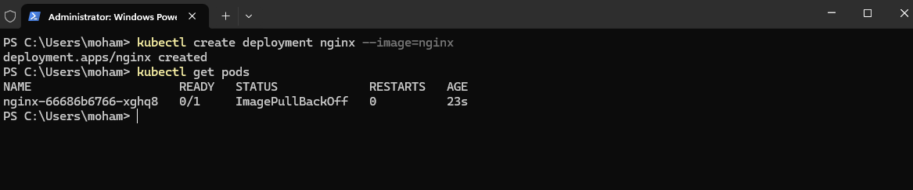
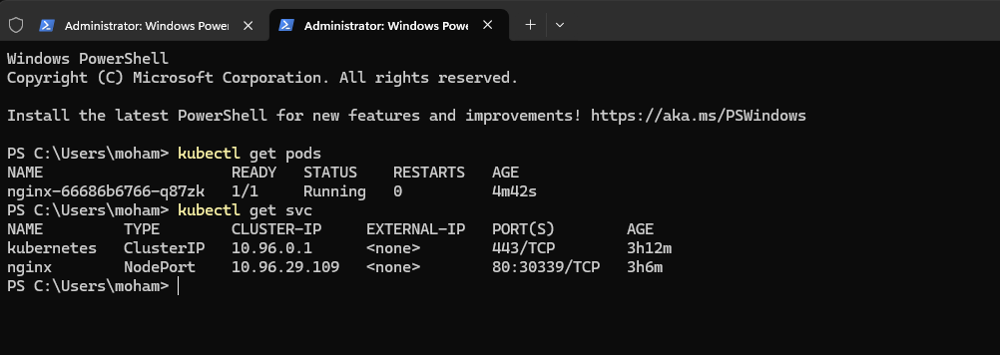
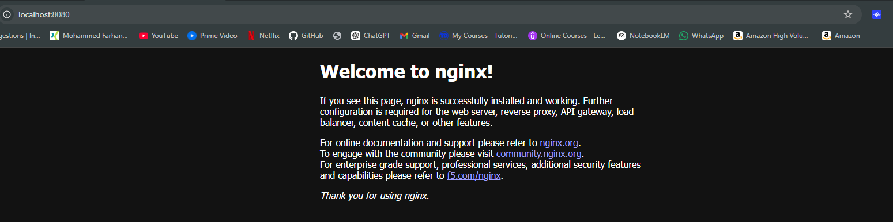

# Kubernetes Nginx Deployment

This project demonstrates deploying a containerized Nginx application on a Kubernetes cluster using kubectl and exposing it via a service.

## Architecture
- Kubernetes cluster (Docker Desktop)
- Nginx container deployment
- NodePort service exposure
- Port-forward access

## Deployment Steps

Create deployment:
```bash
kubectl apply -f deployment.yaml

```
Create Service

```bash
kubectl apply -f service.yaml
```
## Verify Resources
Check pods:
```bash
kubectl get pods
```

Check service
```bash
kubectl get svc
```

## Access Application:
Using port-forward
```bash
kubectl port-forward deployment/nginx 8080:80
```
Open in browser
```bash
http://localhost:8080
```


## Project Structure
```bash
.
├── deployment.yaml
├── service.yaml
└── screenshots/
```
## Skills Demonstrated
• Kubernetes Deployment  
• Kubernetes Services  
• kubectl CLI  
• YAML manifests  
• Container orchestration  
• Local Kubernetes cluster setup  
